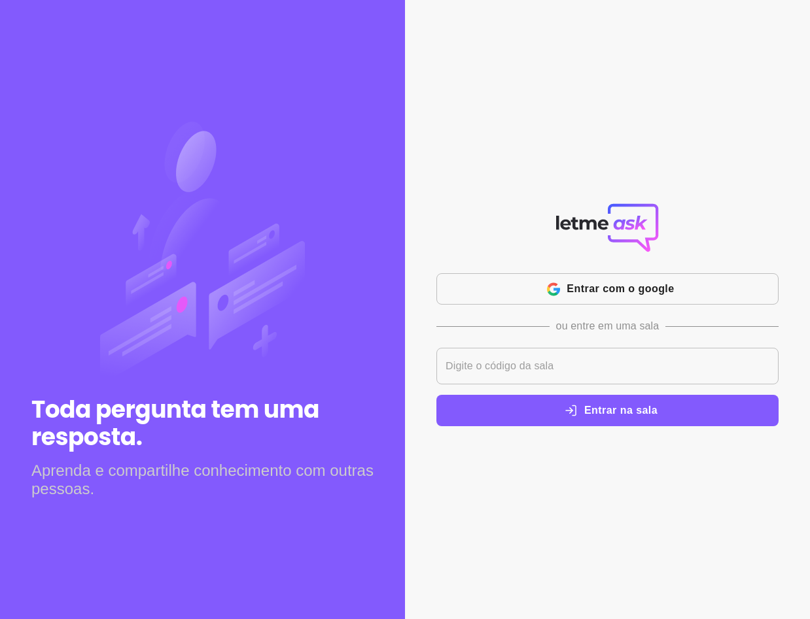

  
   
  

  

 
  
  
  
  

 <a href="#information_source-about">About</a> •
 <a href="#arrow_forward-run">Run</a> •
 <a href="#hammer_and_wrench-technologies">Technologies</a> •
 <a href="#boy-author">Author</a> •
 <a href="#balance_scale-license">License</a>

  
---
## :information_source: About
#### App developed during Rocketseat's NLW together!

---

## :arrow_forward: **Run**

To run the project you need to clone or [`download`](https://github.com/SampaioLeal/nlw-letmeask/archive/main.zip) this repository, have the Node Package Manager ([`NPM`](https://www.npmjs.com/get-npm)) or the YARN Package Manager installed ([`YARN`](https://yarnpkg.com/getting-started)).

---

## :hammer_and_wrench: **Technologies**

The following tools is used to build this project:

| :globe_with_meridians: Web | :file_cabinet: Server |
| :------------------------: | :-------------------: |
|          ReactJS           |       Firebase        |
|         TypeScript         |

---

## :boy: **Author**

<a href="https://github.com/SampaioLeal">
 
  
 <b>Sampaio Leal</b>
</a>

Developed with ❤️ by Sampaio Leal 👋🏽 Contact me!

---

## :balance_scale: **License**

Copyright © 2021 [Sampaio Leal](https://github.com/SampaioLeal). 

